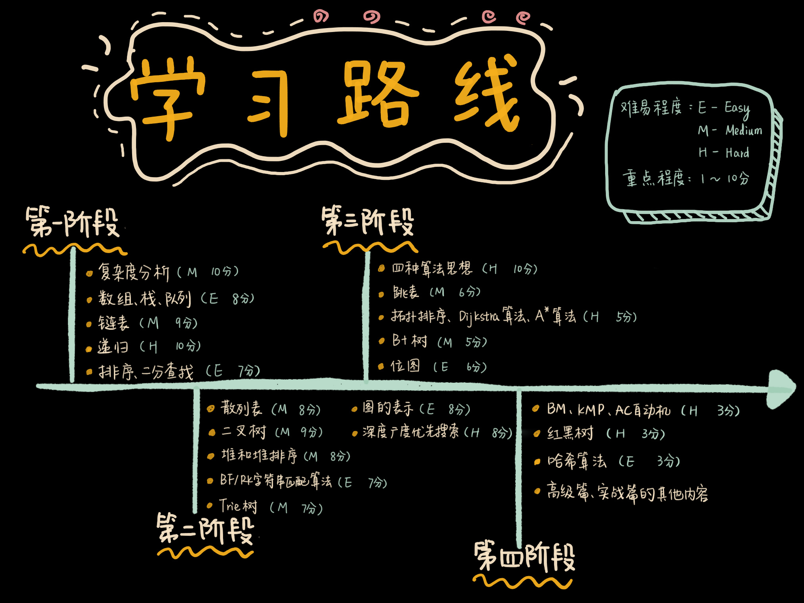

# Swift-Algorithm

Following [数据结构与算法之美](https://time.geekbang.org/column/intro/100017301) from Geekbang(极客时间). Practice data structure and algorithms using Swift.

## Learning path

## Data Structure

* [Stack](./data_structure/stack)
* [Queue](./data_structure/queue)
* [Linked List](./data_structure/linked_list)
* [Tree](./data_structure/tree)

## Algorithm

* Sorting
* Searching
