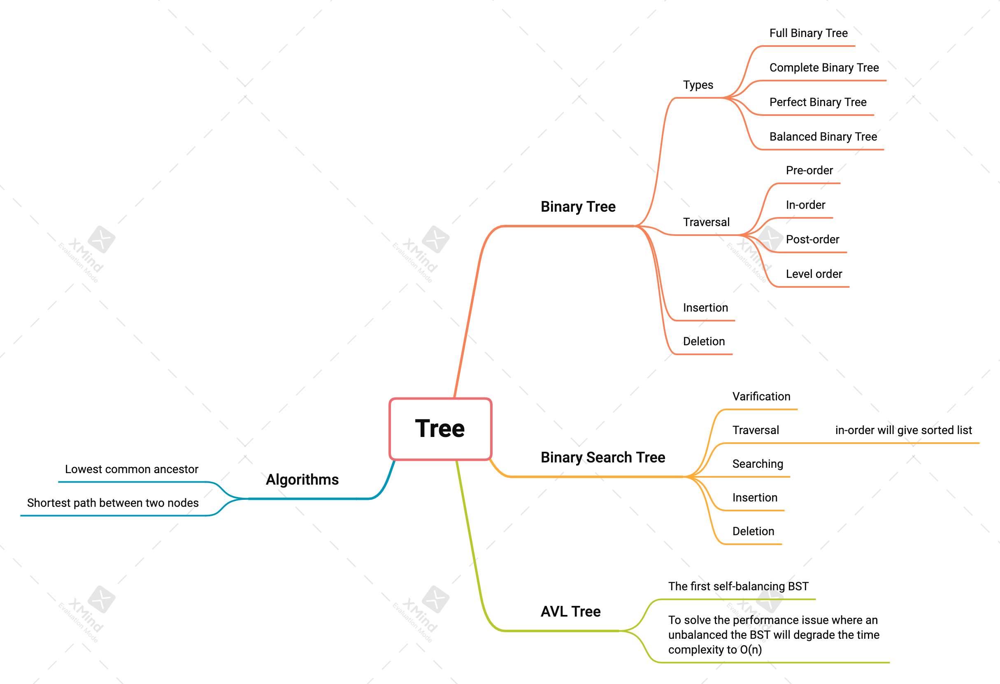

# Tree

Typical tree types are:

- Tries
- Binary Trees
- [Binary Search Trees(BST)](../binary_search_tree)
  - AVL Trees
  - Red-Black Trees(RBT)

Common tree traversal algorithms

- Depth-first traversal
- Level-order traversal

## Binary Trees

A binary tree is a tree in which each node has at most **two children**, often referred to as the **left** and **right** children.

Traversal algorithms

- In-order traversal
- Pre-order traversal
- Post-order traversal

## Binary Search Trees(BST)

BST is a specify type of Binary Trees that follows two rules:

- The value of a **left child** must be less than the value of its **parent**.
- Consequently, the value of a **right child** must be greater than or equal to the value of its **parent**.

It is a powerful data structure for holding **sorted** data. The average time complexity for _lookup_, _insert_ and _removal_ is **O(log n)**, which is considerably faster than linear data structures such as arrays and linked lists.

However, in the worst cases, the time complexity will degrade to **O(n)** if the tree becomes unbalanced.

## AVL Trees

In 1962, Georgy Adelson-Velsky and Evgenii Landis came up with the first **self-balancing binary search tree**: The **AVL Tree**. This is to solve the performance issue where an unbalanced the BST will degrade the time complexity to **O(n)**.
